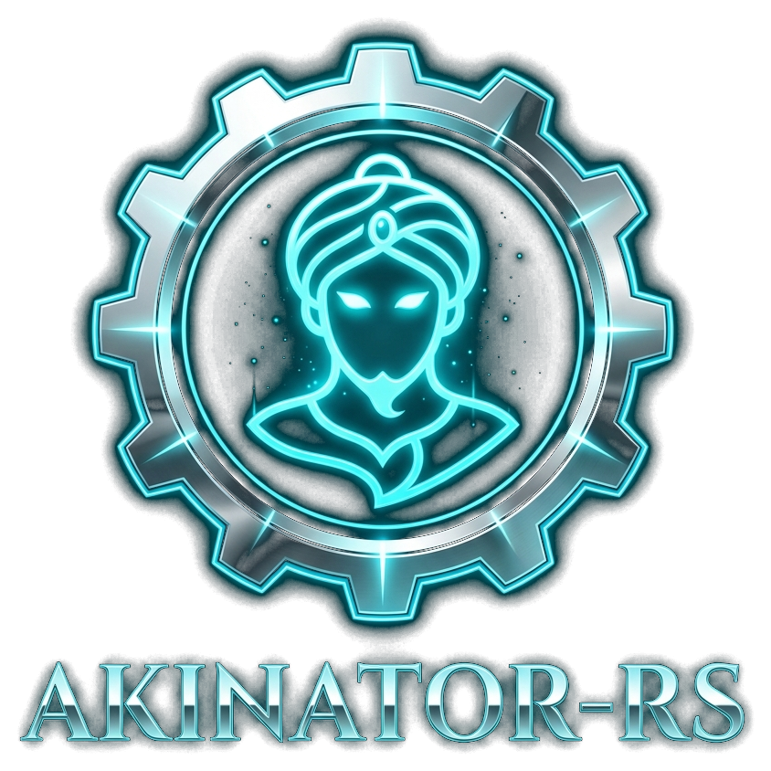

<div align="center">



# akinator-rs

[](https://www.rust-lang.org)
[](https://crates.io/crates/akinator-rs)
[](https://docs.rs/akinator-rs)
[](LICENSE-MIT)
[](https://github.com/FLEX-GHOST/akinator-rs)
[](https://github.com/FLEX-GHOST/akinator-rs)

**A high-performance, asynchronous, pure Rust client library for the Akinator game.**

<p align="center">
  <a href="#features">Features</a> •
  <a href="#core-dependencies">Dependencies</a> •
  <a href="#installation">Installation</a> •
  <a href="#quick-start">Quick Start</a> •
  <a href="#supported-languages">Languages</a> •
  <a href="#advanced-usage">Advanced Usage</a> •
  <a href="#license">License</a>
</p>

</div>

---

## Features

- **Pure Rust Engine**: Native implementation without any external runtime wrappers or foreign process bindings.
- **Automated Anti-Bot Bypass**: Incorporates BoringSSL browser-grade TLS ClientHello fingerprinting (`wreq`) and header emulation to bypass Cloudflare Bot Management natively with **zero proxies**.
- **Asynchronous Architecture**: Fully non-blocking I/O driven by `tokio`.
- **Engineered Memory Footprint**: Configured with `tikv-jemallocator` background purging threads (`dirty_decay_ms:0,muzzy_decay_ms:0`) to immediately reclaim memory back to the OS.
- **16 Global Languages**: Native localization across Arabic, English, French, Spanish, German, Russian, Japanese, and more.
- **Multiple Game Modes**: Full support for Characters, Objects, and Animals themes.
- **Media & Photo Helpers**: Dedicated methods to download guess character photos directly to disk or memory.
- **Session Persistence**: Complete state export and import capabilities, with a thread-safe TTL `SessionManager`.

---

## Core Dependencies

| Component | Technology | Version | Purpose |
|:---|:---|:---:|:---|
| **Language & Edition** | [](https://www.rust-lang.org) | `2024` | Modern, safe, high-performance systems programming |
| **HTTP & TLS Engine** | [](https://crates.io/crates/wreq) | `0.16.1` | Native browser TLS fingerprinting & Cloudflare bypass |
| **Async Runtime** | [](https://tokio.rs) | `1.53.1` | Non-blocking, multi-threaded asynchronous execution |
| **Memory Allocator** | [](https://crates.io/crates/tikv-jemallocator) | `0.7.0` | Background memory purging & low RAM footprint |
| **Serialization** | [](https://serde.rs) | `1.0.229` | Fast zero-copy JSON parsing & session serialization |
| **Error Handling** | [](https://crates.io/crates/thiserror) | `2.0.20` | Ergonomic, strongly-typed custom error propagation |
| **Pattern Matching** | [](https://crates.io/crates/regex) | `1.13.1` | High-speed HTML session metadata extraction |

---

## Installation

Add `akinator-rs` to your `Cargo.toml`:

```toml
[dependencies]
akinator-rs = { git = "https://github.com/FLEX-GHOST/akinator-rs.git" }
tokio = { version = "1.0", features = ["full"] }
```

---

## Quick Start

```rust
use akinator_rs::{AkinatorBuilder, Answer, Language, StepResult, Theme};

#[tokio::main]
async fn main() -> Result<(), Box<dyn std::error::Error>> {
    let mut aki = AkinatorBuilder::new()
        .language(Language::Arabic)
        .theme(Theme::Characters)
        .build()?;

    let mut step = aki.start().await?;

    while let StepResult::Question { question, progression, step: idx, .. } = step {
        println!("[Q{}] {} ({:.1}%)", idx + 1, question, progression);
        
        step = aki.answer(Answer::Yes).await?;
    }

    match step {
        StepResult::Guess(guess) => {
            println!("Prediction: {}", guess.name);
            println!("Description: {}", guess.description);
            if let Some(photo_url) = guess.photo_url() {
                println!("Photo URL: {}", photo_url);
            }

            aki.submit_win().await?;
        }
        StepResult::GiveUp => {
            println!("Akinator was unable to guess your entity.");
        }
        _ => {}
    }

    Ok(())
}
```

---

## Supported Languages

| Code | Language | Code | Language |
|:---:|:---|:---:|:---|
| `ar` | 🇮🇶 Arabic | `en` | 🇬🇧 English |
| `fr` | 🇫🇷 French | `es` | 🇪🇸 Spanish |
| `de` | 🇩🇪 German | `it` | 🇮🇹 Italian |
| `pt` | 🇵🇹 Portuguese | `ru` | 🇷🇺 Russian |
| `tr` | 🇹🇷 Turkish | `ja` | 🇯🇵 Japanese |
| `ko` | 🇰🇷 Korean | `zh` | 🇨🇳 Chinese |
| `id` | 🇮🇩 Indonesian | `nl` | 🇳🇱 Dutch |
| `pl` | 🇵🇱 Polish | `il` | 🇮🇱 Hebrew |

---

## Available Answers

| Variant | Value | Description |
|:---|:---:|:---|
| `Answer::Yes` | `0` | Affirmative answer |
| `Answer::No` | `1` | Negative answer |
| `Answer::DontKnow` | `2` | Unknown / Not sure |
| `Answer::Probably` | `3` | Likely / Leaning yes |
| `Answer::ProbablyNot` | `4` | Unlikely / Leaning no |

---

## Advanced Usage

### Backtracking to Previous Step
```rust
let previous_question = aki.back().await?;
```

### Continuing Game on Rejected Guess
```rust
let next_question = aki.continue_game().await?;
```

### Photo Acquisition & Streaming to Disk
```rust
// Stream directly to disk path to avoid RAM accumulation:
if let Some(saved_path) = aki.fetch_guess_photo_to_file("guess.jpg").await? {
    println!("Saved image to {:?}", saved_path);
}
```

### State Serialization & Resumption
```rust
// Export active state
let state = aki.export_session();
let serialized = serde_json::to_string(&state)?;

// Reconstruct active session later
let mut resumed_aki = Akinator::from_session(state)?;
```

---

## License

Dual-licensed under either:

- Apache License, Version 2.0 ([LICENSE-APACHE](LICENSE-APACHE) or http://www.apache.org/licenses/LICENSE-2.0)
- MIT License ([LICENSE-MIT](LICENSE-MIT) or http://opensource.org/licenses/MIT)

at your option.
